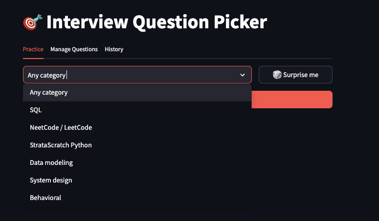
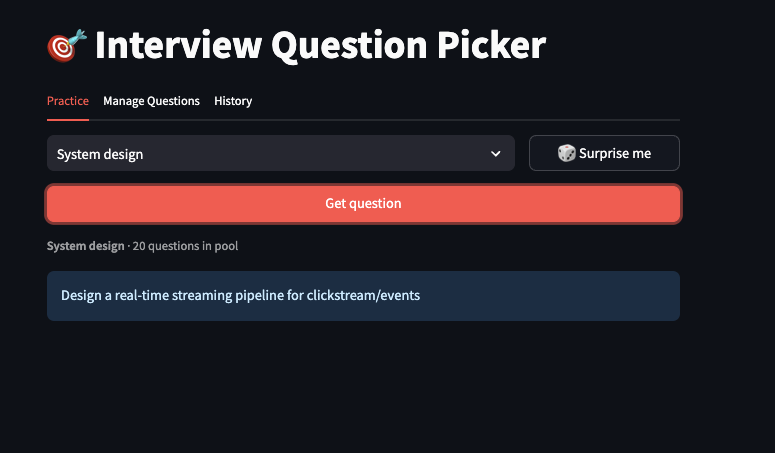
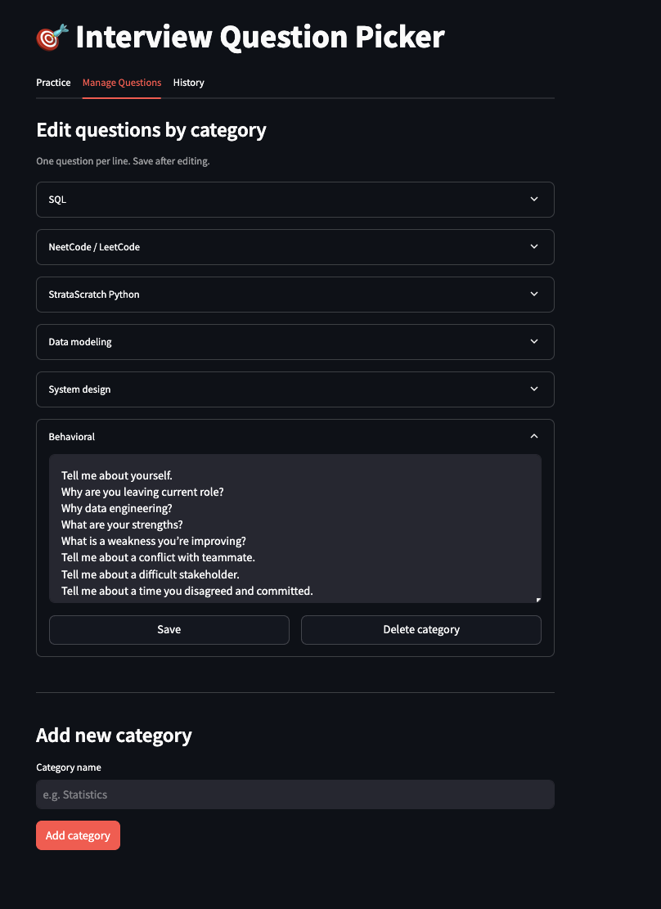

# Interview Random Question Picker

A Streamlit app that randomly picks interview practice questions by category.



## Features

- Pick a random question from a specific category or any category
- "Surprise me" button for a fully random pick
- Manage questions — add, edit, and delete categories and questions in the browser
- Session history of all questions shown

## Project structure

```
interview_random_question_picker/
├── app.py                    # Streamlit app
├── default_questions.json    # Starting questions (edit to customize defaults)
├── questions.json            # Live working copy (auto-generated on first run)
├── requirements.txt
└── images/
    └── app_screenshot.png    # Add your screenshots here
```

## Getting started

**1. Install dependencies**

```bash
pip install -r requirements.txt
```

**2. Run the app**

```bash
streamlit run app.py
```

Opens in your browser at `http://localhost:8501`.

## Customizing questions

Edit `default_questions.json` to set your own starting questions before the first run.

```json
{
  "My Category": [
    "Question one.",
    "Question two."
  ]
}
```

`default_questions.json` is only used to seed `questions.json` on the very first run. After that, use the **Manage Questions** tab in the app to add, edit, or delete questions — those changes are saved to `questions.json`.

To reset to your defaults, delete `questions.json` and restart the app.

## Screenshots

| Practice tab | Manage Questions tab |
|---|---|
|  |  |  |


